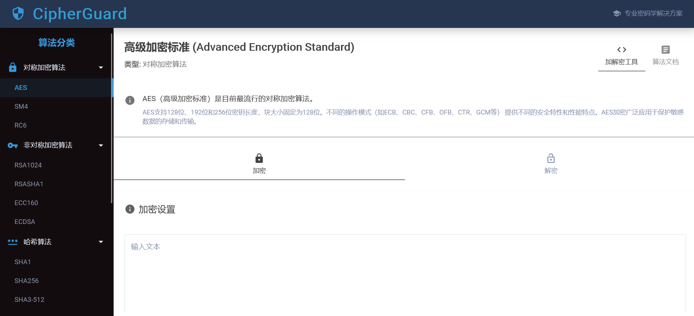

# 🔐 CipherGuard

[](https://opensource.org/licenses/MIT)


基于React和SpringBoot构建的可视化密码学工具平台，集成15+种加密算法的加密/解密/签名验证功能，提供直观的Web界面操作。  
后端代码在：https://github.com/lzy-2004/cryptographic-library-spring.git


## 界面预览
 

## 🚀 功能特性

### 算法支持

| 类型         | 算法列表                                                                 |
|--------------|--------------------------------------------------------------------------|
| 对称加密     | AES、SM4、RC6                                                           |
| 非对称加密   | RSA-1024、ECC-160、ECDSA、RSA-SHA1                                                |
| 哈希算法     | SHA1、SHA256、SHA3-512、RIPEMD160、MD5                                      |
| 消息认证码   | HMAC-SHA1、HMAC-SHA256                                                  |
| 密钥派生     | PBKDF2                                                                  |
| 编码转换     | Base64、UTF-8、Hex                                                           |

### 核心功能

- 动态加密操作实时反馈
- 多编码格式支持（HEX/Base64）
- 密钥生成/导出功能
- 响应式Material-UI界面
- 操作状态实时提示

## 🛠 技术栈

**前端框架**  
React 19 + JavaScript  
**UI组件库**  
@mui/material 7 + emotion        
**HTTP客户端**  
Axios 1.x  

## 📦 快速开始

### 环境要求

- Node.js ≥16.14.0
- npm ≥8.5.0 或 yarn ≥3.2.0

```bash
# 克隆仓库
git clone https://github.com/lzy-2004/cryptographic-library-react.git

# 安装依赖
npm install

# 启动开发服务器
npm start

# 访问地址
http://localhost:3000
